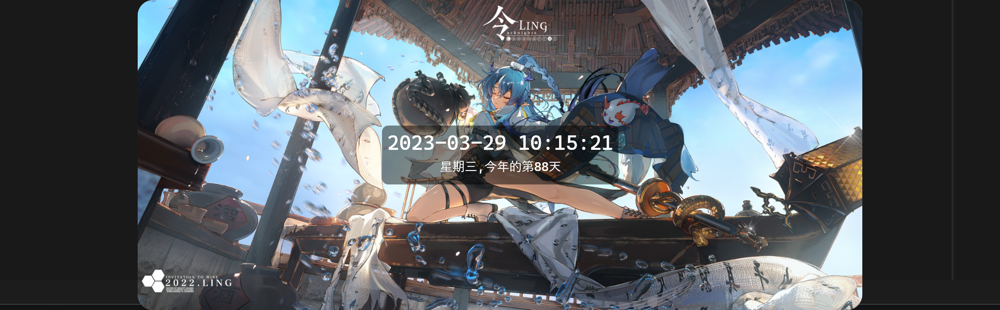
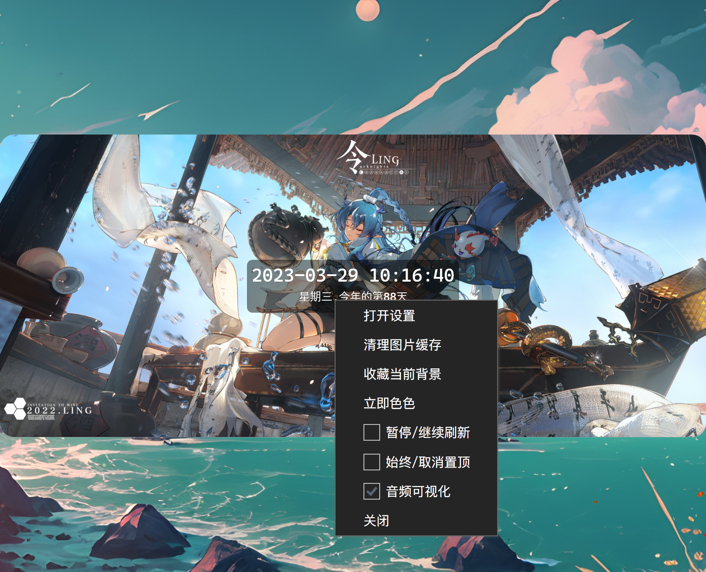
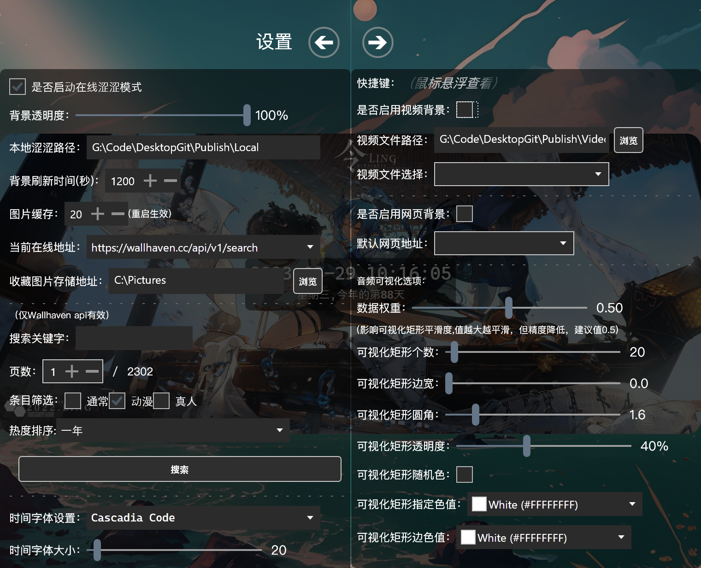

# 一个桌面时钟
# Intro

## 当前仓库已重构！获取新的更新请移步[此处](https://github.com/Type3limit/DesktopTimerWPFUIRemake)！
上班摸鱼时的副产物，目前来说主要完成的功能有:  
 >1.基本时间展示功能  
 >2.可自定义的字体以及字体大小以及颜色  
 >3.支持自定义本地背景（```[右键打开]```设置，指定本地图片路径）  
 >4.支持在线图库（接入三方api，具体地址可以在设置页看到详细路径，感谢大佬们提供）  
 >5.支持视频背景（设置页选中一个带有视频的文件路径，默认自带一个视频）  
 >6.支持一键隐藏（<kbd>Shift</kbd>+<kbd>Alt</kbd>+<kbd>H</kbd>）、一键切换（<kbd>Shift</kbd>+<kbd>Alt</kbd>+<kbd>F</kbd>）等等快捷键，具体```[右键后悬浮查看]```  
 >7.支持置顶以及取消  
 >8.支持网页背景
 >9.支持快速调出翻译窗口```对接百度翻译和有道翻译```

## 效果预览

- 常规图片背景：
  

- 右键:
  

- 设置：
  

- 翻译：
  

- 音频可视化：
  

- 网页背景：
  ```[时间区可以通过快捷键隐藏]```
  


